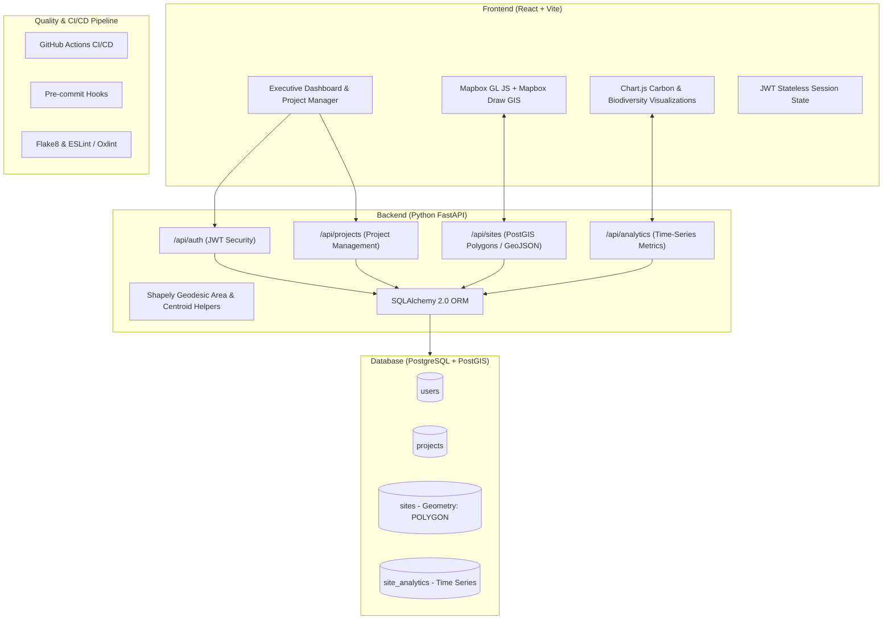
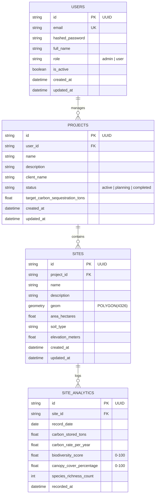

# 🌱 Darukaa.Earth | Geospatial Carbon & Ecological Intelligence Platform

> **Full-Stack Developer Hackathon Submission for Darukaa.Earth**  
> An end-to-end geospatial application for monitoring land restoration projects, digitizing site boundaries with **Mapbox GL JS** and storing them in **PostGIS**, and visualizing multi-year carbon sequestration and biodiversity trends using **Chart.js**.

---

## 🏛️ System Architecture



---

## 🛠️ Technology Stack & Purpose

| Layer | Technology | Purpose |
| :--- | :--- | :--- |
| **Frontend Framework** | **React 19 + Vite** | Fast, reactive Single Page Application with instantaneous Hot Module Reloading. |
| **Interactive GIS Map** | **Mapbox GL JS** | High-performance WebGL vector and satellite tile mapping engine. |
| **Polygon Drawing** | **@mapbox/mapbox-gl-draw** | On-screen geospatial boundary drawing and live polygon vertex manipulation. |
| **Analytics Visualizations** | **Chart.js (react-chartjs-2)** | Multi-axis time-series curves for cumulative carbon capture and biodiversity health. |
| **Backend API** | **Python FastAPI** | Asynchronous RESTful API framework with automatic OpenAPI interactive docs (`/docs`). |
| **Spatial Database** | **PostgreSQL + PostGIS** | Relational and spatial database engine storing polygon geometries (`POLYGON(4326)`). |
| **ORM & Spatial Tools** | **SQLAlchemy 2.0, GeoAlchemy2 & Shapely** | Database abstraction, spatial geodesic area calculation in hectares, and GeoJSON serialization. |
| **Security & Auth** | **JWT (python-jose) + bcrypt** | Stateless cryptographic token issuance and secure password hashing. |
| **Quality & CI/CD** | **GitHub Actions, Prettier, Flake8, Oxlint** | Automated test pipelines and code hygiene validation before commit. |

---

## 🗄️ Database Schema & PostGIS Tables



---

## 🚀 Quick Start Guide (Step-by-Step)

### Prerequisites
- **Python 3.10+** (Python 3.12 verified)
- **Node.js 18+** (Node v22 verified) & `npm`
- **Git**

---

### 1. Backend Setup (FastAPI)

```bash
# Navigate to backend directory
cd backend

# Create and activate Python virtual environment
python -m venv venv

# Windows PowerShell:
.\venv\Scripts\Activate.ps1
# Linux/macOS:
source venv/bin/activate

# Install dependencies
pip install -r requirements.txt

# Start FastAPI server
python -m uvicorn app.main:app --reload --port 8000
```

> **API Documentation**: Open your browser at **http://localhost:8000/docs** to explore interactive Swagger OpenAPI documentation.

---

### 2. Frontend Setup (React + Vite)

```bash
# In a new terminal, navigate to frontend directory
cd frontend

# Install packages
npm install

# Start Vite development server
npm run dev
```

> **Frontend Application**: Open **http://localhost:5173** to access the application.

---

## 🔑 Demo Credentials (1-Click Login Supported)

| Account Type | Email | Password | Role / Access |
| :--- | :--- | :--- | :--- |
| **Administrator** | `admin@darukaa.earth` | `AdminPassword123!` | Full Administrative Privileges & Management |
| **Ecologist** | `ecologist@darukaa.earth` | `Ecologist2026!` | Project & Site GIS Mapping |

*(You can also register any new user directly via the Register page)*

---

## 🧪 Testing & Code Quality Suite

### Backend Testing & Linting
```bash
cd backend

# Run automated Pytest test suite (Auth, Projects, Sites GeoJSON, Analytics)
pytest

# Run Flake8 PEP 8 Python linter
flake8 . --count --max-line-length=120 --exclude=venv
```

### Frontend Testing & Linting
```bash
cd frontend

# Run Oxlint / ESLint
npm run lint

# Verify Production Build
npm run build
```

---

## 🛰️ Key Features Walkthrough

1. **Interactive Geospatial Polygon Mapping**:
   - Trace restoration site boundaries directly on satellite or street vector maps.
   - PostGIS automatically computes geodesic area in hectares.
   - Interactive popups display instant carbon metrics upon clicking any site polygon.

2. **Time-Series Carbon & Biodiversity Analytics**:
   - Interactive Chart.js graphs displaying cumulative carbon stored (tons CO₂e) and annual sequestration rates.
   - Biodiversity index tracking and canopy cover percentages over months and years.

3. **Restoration Project Management**:
   - Filter projects by status (`active`, `planning`, `completed`).
   - Associate multiple distinct geographical sites with a parent project.
   - Aggregate project-level environmental metrics.

4. **Security & Role-Based Access**:
   - Stateless JWT authentication with secure password hashing.
   - Role enforcement distinguishing standard Ecologists from Platform Admins.

---

## ☁️ Public Deployment Guide

### Option 1: Backend Deployment (Render / Railway / Fly.io)
1. Link your GitHub repository to [Render](https://render.com).
2. Set Environment: **Python 3**.
3. Build Command: `pip install -r backend/requirements.txt`.
4. Start Command: `uvicorn app.main:app --host 0.0.0.0 --port $PORT --app-dir backend`.
5. Provide environment variables: `DATABASE_URL` (e.g. Neon / Supabase PostGIS connection string) and `JWT_SECRET_KEY`.

### Option 2: Frontend Deployment (Vercel / Netlify / Cloudflare Pages)
1. Link repository to [Vercel](https://vercel.com).
2. Root Directory: `frontend`.
3. Build Command: `npm run build`.
4. Output Directory: `dist`.
5. Environment Variables:
   - `VITE_API_BASE_URL`: `https://your-backend-render-app.onrender.com/api`
   - `VITE_MAPBOX_TOKEN`: `pk.eyJ...`

---

## 📄 License
Built for the **Darukaa.Earth Full-Stack Developer Hackathon**.
